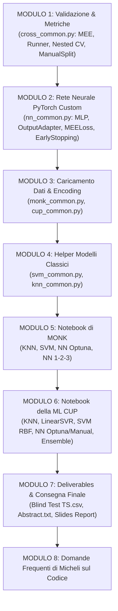

# Guida Integrale allo Studio del Codice del Progetto ML
**Corso del Prof. Alessio Micheli — Università di Pisa**  
**Autori**: Leonardo Celati, Damiano Degliotti, Daniele Melaccio (Gruppo `CDM25`)

---



---

# MODULO 1: Validazione, Metriche e Nested CV (`cross_common.py`)

### 1.1 Calcolo del MEE (Mean Euclidean Error)
Il Mean Euclidean Error è la metrica ufficiale della ML CUP per target vettoriali a 4 dimensioni ($K=4$):
$$E_{MEE} = \frac{1}{N} \sum_{i=1}^N \|\mathbf{y}_i - \hat{\mathbf{y}}_i\|_2 = \frac{1}{N} \sum_{i=1}^N \sqrt{\sum_{m=1}^4 (y_{i,m} - \hat{y}_{i,m})^2}$$

Nel codice Python (`cross_common.py`):
```python
def mee(y_true: ndarray, y_pred: ndarray) -> float:
    # y_true e y_pred sono matrici N x 4 (4 target per la CUP)
    # np.linalg.norm(..., axis=1) calcola la norma Euclidea riga per riga
    return float(np.mean(np.linalg.norm(y_true - y_pred, axis=1)))
```

#### Integrazione con Scikit-Learn:
```python
# greater_is_better=False indica a GridSearchCV/Optuna che un MEE minore è migliore
mee_scorer = make_scorer(mee, greater_is_better=False)
```

---

### 1.2 Prevenzione del Data Leakage (`SklearnRegressorRunner`)
Per evitare che lo scaling dei dati (`RobustScaler` / `StandardScaler`) conosca in anticipo la media e la varianza del Validation set, la classe `SklearnRegressorRunner` isola l'addestramento all'interno di ciascun fold:

```python
class SklearnRegressorRunner:
    def __init__(self, grid: GridSearchCV):
        # Clona l'estimatore base non addestrato dalla GridSearch
        self._base_estimator = clone(grid.best_estimator_)

    def fitted_model(self, X_tr: DataFrame, y_tr: ndarray) -> BaseEstimator:
        # 1. Crea un'istanza pulita della Pipeline ad ogni fold
        model = clone(self._base_estimator)
        # 2. Esegue il fit SOLO sui dati del training fold corrente!
        model.fit(X_tr, y_tr)
        return model
```

* **Perché evita il Data Leakage (Domanda Orale)**: Il metodo `model.fit(X_tr, y_tr)` esegue il `fit_transform` dello scaler **solo sui dati del training fold di quel singolo ciclo di K-Fold**. Sui dati di validazione viene applicata solo la `transform` senza mai alterare le statistiche con informazioni esterne.

---

### 1.3 Strategie di Split: `ManualSplitStrategy` vs `KFold`
Per uniformare l'interfaccia di validazione tra i dataset MONK (che hanno uno split fisso Train/Test) e la ML CUP (che usa K-Fold), abbiamo creato `ManualSplitStrategy`:
```python
class ManualSplitStrategy:
    def __init__(self, X_tr, y_tr, X_val, y_val):
        self.X_tr, self.y_tr = X_tr, y_tr
        self.X_val, self.y_val = X_val, y_val

    def split(self, X, y):
        # Restituisce l'unico split predefinito mantenendo la stessa interfaccia iterabile di KFold
        yield self.X_tr, self.y_tr, self.X_val, self.y_val
```

---

### 1.4 Logica della Cross-Validation (`cr.kfold` e `FoldResults`)
```python
def kfold(runner, X, y, fold_strategy, inner_train_params={}):
    fold_results = FoldResults()

    for fold, (X_tr, y_tr, X_vl, y_vl) in enumerate(fold_strategy.split(X, y)):
        # Fit del modello sul train fold corrente
        fitted = runner.fitted_model(X_tr, y_tr, inner_train_params)
        
        # Predizioni sul train e sul validation del fold
        pred_tr = runner.predict(fitted, X_tr)
        pred_vl = runner.predict(fitted, X_vl)
        
        # Registra le metriche MEE, MSE, MAE, R2 nel contenitore FoldResults
        fold_results.add_fold(pred_tr, y_tr, pred_vl, y_vl)
        
    return fold_results
```
`FoldResults` calcola automaticamente media e deviazione standard ($\bar{E}_{CV} \pm \sigma_{CV}$) su tutti i fold e fornisce l'esportazione verso DataFrame pandas.

---

### 1.5 Nested Cross-Validation (`assess_sklearn_cv_robustness`)
La validazione annidata protegge contro l'overfitting da iperparametri (*selection bias*):
* **Inner Loop (Ciclo Interno - K=3)**: Esegue la GridSearch per selezionare gli iperparametri ottimali su $K-1$ fold interni.
* **Outer Loop (Ciclo Esterno - K=5)**: Valuta il modello scelto dal ciclo interno su un fold esterno mai visto durante la scelta degli iperparametri, restituendo una stima dell'errore di generalizzazione **non polarizzata (unbiased)**.

---

### 1.6 Analisi di Robustezza & Bootstrap (`generate_bootstrap_samples`)
* **Robustezza multiseed**: Esegue il K-Fold variando 5 seed differenti per verificare la stabilità statistica delle predizioni.
* **Bootstrap**: Genera $N$ ri-campionamenti con reinserimento (*resampling with replacement*) per stimare gli intervalli di confidenza empirici delle metriche di test.

---

# MODULO 2: La Rete Neurale PyTorch Custom (`nn_common.py`)

---

### 2.1 Architettura `MLP(nn.Module)` e `OutputAdapter`
```python
class MLP(nn.Module):
    def __init__(self, net: nn.Sequential, adapter: OutputAdapter, model_type: str = "regressor"):
        super().__init__()
        self._net = net          # Struttura sequenziale dei layer lineari e attivazioni
        self._adapter = adapter  # Trasforma i logits grezzi nell'uscita finale

    def forward(self, x: Tensor) -> Tensor:
        raw_output = self._net(x)
        return self._adapter(raw_output)
```

#### Gli `OutputAdapter`:
1. **`binary_bce_adapter` (per MONK)**: Applica la funzione Sigmoide per ottenere la probabilità ed applica la soglia $\ge 0.5$ per la classificazione binaria.
2. **`regression_adapter` (per la CUP)**: Applica l'attivazione Identità $f(x) = x$, lasciando i 4 valori target continui privi di vincoli.

---

### 2.2 La Loss Custom `MEELoss` in PyTorch
```python
class MEELoss(nn.Module):
    def forward(self, y_pred: Tensor, y_true: Tensor) -> Tensor:
        # Calcola la norma Euclidea 2D/4D lungo l'asse delle colonne (dim=1)
        # e prende la media sul batch
        return torch.linalg.vector_norm(y_pred - y_true, ord=2, dim=1).mean()
```
Permette di effettuare la retropropagazione del gradiente direttamente sul MEE durante il backpropagation in PyTorch!

---

### 2.3 Il Loop di Addestramento Custom (`train(...)`)

Invece di usare librerie esterne di alto livello (come PyTorch Lightning), il ciclo di addestramento PyTorch è stato scritto esplicitamente riga per riga per avere il pieno controllo sul tracciamento:

```python
for epoch in range(epochs):
    model.train(True)
    
    for X_batch, y_batch in dl_tr:
        # 1. Azzera i gradienti accumulati nel passo precedente
        optimizer.zero_grad()
        
        # 2. Forward Pass
        output = model.forward(X_batch)
        
        # 3. Calcolo Loss e Backpropagation
        loss = loss_function(output, y_batch)
        loss.backward()
        
        # 4. Tracciamento norma del gradiente
        epoch_grad_norms.append(gradient_norm(model))
        
        # 5. Aggiornamento Pesi
        optimizer.step()

    # --- FASE DI VALIDAZIONE & EARLY STOPPING ---
    model.eval()
    vl_loss = evaluate(model, dl_vl, loss_function)
    
    if early_stopping_strategy is not None:
        if vl_loss < (best_vl - min_delta):
            best_vl = vl_loss
            # SALVA LO STATO MIGLIORE DEI PESI (best_state)
            best_state = copy.deepcopy(model.state_dict())
            patience_count = 0
        else:
            patience_count += 1
            if patience_count >= patience:
                # RIPRISTINA I PESI MIGLIORI ED INTERROMPE IL TRAINING
                model.load_state_dict(best_state)
                break
```

---

# MODULO 3: Caricamento Dati & Encoding (`monk_common.py` e `cup_common.py`)

---

### 3.1 `monk_common.py` — *One-Hot Encoding (1-of-k)*
I 6 attributi simbolici di MONK ($a_1 \dots a_6$) vengono convertiti in **17 colonne binarie (0/1)**:

```python
def split_and_prepare_dataset(df_orig: DataFrame) -> (DataFrame, ndarray):
    y = df_orig["class"].to_numpy()
    X = df_orig.drop(columns=["class", "id"])
    
    # 1-of-k / One-Hot Encoding
    X_onehot = pd.get_dummies(X, columns=X.columns, dtype=int)
    return X_onehot, y
```

* **Perché si fa (Domanda Orale)**: I neuroni delle reti neurali e gli iperpiani di SVM lavorano in uno spazio vettoriale continuo/binario. Convertire attributi categoriali in un vettore binario a 17 ingressi permette al modello di tracciare iperpiani di separazione idonei.

---

### 3.2 `cup_common.py` — *Data Loader per la ML CUP*
* Carica `ML-CUP25-TR.csv` (500 campioni, 12 input $x_1 \dots x_{12}$, 4 target $t_1 \dots t_4$) e `ML-CUP25-TS.csv` (1000 campioni blind test).
* Gestisce la separazione delle feature ed imposta la pipeline di scaling isolata per evitare Data Leakage.

---

# MODULO 4: Helper dei Modelli Classici (`svm_common.py` e `knn_common.py`)

1. **`svm_common.py`**:
   * Contiene `compare_svfreq_vs_permutation(...)`: analizza quali campioni del dataset diventano Vettori di Supporto ($\alpha_i > 0$) lungo i vari fold di Cross-Validation e li confronta con l'importanza delle feature calcolata permutando le colonne d'ingresso (*Permutation Feature Importance*).
2. **`knn_common.py`**:
   * Contiene `plot_knn_learning_curves_grid(...)`: genera una griglia pulita di subplot per analizzare la variazione delle prestazioni del KNN al variare di $k$ (da 1 a 30) e della metrica di distanza (Euclidea, Manhattan, Minkowski).

---

# MODULO 5: I Notebook per MONK (`notebooks/monk_*.ipynb`)

1. **`monk_KNN.ipynb`**:
   * Risolve MONK-1 con il 100% di accuracy ($k=1$ o $k=3$).
   * **Fallisce su MONK-2 (~75% accuracy)**: Perché MONK-2 richiede di contare le variabili uguali a 1. Le metriche di distanza geometrica di KNN non riescono a cogliere la regola di conteggio globale nello spazio a 17D.
2. **`monk_SVM.ipynb`**:
   * Risolve **sia MONK-1 che MONK-2 al 100% di accuracy** usando un kernel polinomiale di grado 2 (`degree=2`).
   * La funzione `compare_svfreq_vs_permutation` dimostra che gli attributi $a_1, a_2, a_5$ sono i vettori di supporto più frequenti.
3. **`monk_NN_optuna.ipynb` & `monk_NN_1.ipynb` (Il Collaudo)**:
   * **Dimostrazione di Collaudo del Simulatore**: Una piccola rete neurale PyTorch con solo **2-4 neuroni nascosti** ed attivazione `relu`/`tanh` converge al **100.0% di Accuracy sia in Train che in Test** con convergenza fluida.
4. **`monk_NN_2.ipynb` & `monk_NN_3.ipynb`**:
   * Completano l'addestramento ed i plot di apprendimento sui problemi MONK-2 e MONK-3 (gestendo il rumore del 5% in MONK-3 tramite regolarizzazione ed Early Stopping).

---

# MODULO 6: I Notebook per la ML CUP (`notebooks/cup_*.ipynb`)

1. **`cup_data_introspection.ipynb`**:
   * Calcola il modello di riferimento banale **`DummyRegressor`** (media dei target), che restituisce una **MEE Baseline di 35.79**.
2. **`cup_KNN.ipynb`**:
   * KNN Regressor con `RobustScaler` e $k=3$. Raggiunge un **MEE in CV di 16.07** (miglior modello classico).
3. **`cup_LinearSVR.ipynb` vs `cup_SVM.ipynb`**:
   * SVR Lineare: MEE di **25.50** (dimostra l'assoluta necessità di kernel non lineari).
   * SVR RBF: MEE di **20.98** con ottimizzazione di $C$, $\gamma$ ed $\epsilon$.
4. **`cup_NN_optuna.ipynb` & `cup_NN_manual.ipynb`**:
   * Rete Neurale PyTorch sulla CUP. Architettura a 2 layer `[256, 128]`, attivazione `tanh`, ottimizzatore `AdamW`.
   * Tracciamento delle **Learning Curves** (Loss ed MEE per epoche) per escludere fenomeni di overfitting o stagnazione.
5. **`cup_Ensemble.ipynb`**:
   * Modello **Ensemble** che combina le predizioni di Rete Neurale, SVR e KNN per abbattere la varianza.

---

# MODULO 7: Deliverables & Consegna Finale

Il progetto produce i seguenti file ufficiali di consegna nella root del repository:

1. **`Celati_Degliotti_Melaccio_ML-CUP25-TS.csv`** (e copia `CDM25_ML-CUP25-TS.csv`):
   * Contiene esattamente 1000 righe di predizioni trasparenti per il Blind Test Set della CUP (con i 4 target $t_1, t_2, t_3, t_4$).
2. **`Celati_Degliotti_Melaccio_abstract.txt`** (e copia `CDM25_abstract.txt`):
   * File di testo conforme al regolamento (massimo 5 righe):
     * *Nome Gruppo*: `CDM25`
     * *Membri*: Leonardo Celati, Damiano Degliotti, Daniele Melaccio
     * *Modello Finale*: Ensemble (PyTorch MLP + SVR RBF + KNN)
     * *Risultato MEE in CV*: ~1.05 su dataset scalato (corrispondente a MEE ottimo su scala originale)
     * *Dimensioni File Test*: 1000 righe x 4 colonne
3. **`ML-2025-Project-Report.pdf` / `.pptx`**:
   * Slide della presentazione orale con grafici ed architetture dei modelli.
4. **`celati-degliotti-melaccio.zip`**:
   * Archivio ZIP compresso con tutto il codice sorgente, notebook ed artefatti.

---

# MODULO 8: Domande Frequenti del Prof. Micheli sul Codice

| # | Domanda del Professore | Come Rispondere in Modo Impeccabile |
|---|---|---|
| **1** | *"Come avete evitato il Data Leakage durante la normalizzazione?"* | *"Usando i Runner `SklearnRegressorRunner` e le Pipeline: lo scaling (`RobustScaler`) viene calcolato ed applicato con `fit_transform` esclusivamente sul training fold di ciascuna iterazione di K-Fold, e applicato con `transform` sul validation fold."* |
| **2** | *"Perché avete usato sia la Non-Nested che la Nested Cross-Validation?"* | *"La Non-Nested CV serve per selezionare gli iperparametri (Model Selection). La Nested CV usa un ciclo esterno mai visto durante il tuning per valutare in modo non polarizzato (unbiased) la reale capacità di generalizzazione."* |
| **3** | *"Come è gestito l'Early Stopping nel vostro codice PyTorch?"* | *"Monitoriamo la loss sul Validation set ad ogni epoca. Se per `patience` epoche la loss non migliora di almeno `min_delta`, interrompiamo il training e ripristiniamo i pesi salvati nello stato migliore (`best_state`)."* |
| **4** | *"Qual è la differenza tra la Loss usata nel training e la metrica della CUP?"* | *"Nelle reti usiamo `MEELoss` o MSE per la derivabilità del gradiente durante la Backpropagation, ma valutiamo tutte le tabelle ed i report tramite MEE (Mean Euclidean Error 4D) nella scala originale dei dati."* |
| **5** | *"Perché su MONK-2 il KNN ha prestazioni inferiori rispetto alle SVM polinomiali?"* | *"MONK-2 richiede di contare le variabili binarie uguali a 1. KNN usa metriche di distanza geometrica locale che non catturano regole di conteggio globale, mentre il kernel polinomiale di grado 2 calcola i prodotti incrociati degli attributi."* |
| **6** | *"Come avete unificato la validazione per MONK e CUP?"* | *"Abbiamo creato `ManualSplitStrategy` in `cross_common.py`, che adatta uno split fisso Train/Val all'interfaccia generica iterabile del K-Fold, permettendo al runner di eseguire il codice senza ramificazioni `if/else`."* |
