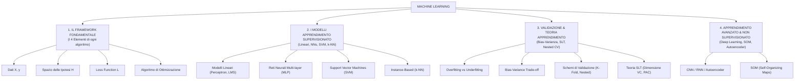
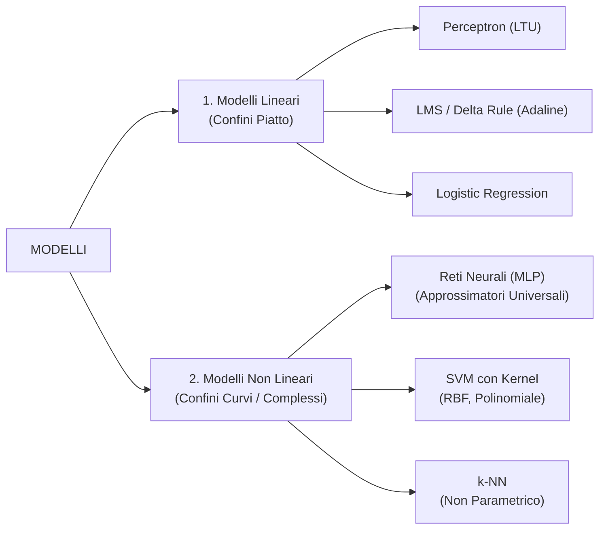
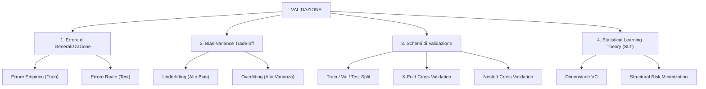

# Mappa Concettuale e Guida allo Studio: Machine Learning
**Corso del Prof. Alessio Micheli — Università di Pisa**

---

## 🗺️ Mappa Concettuale Globale

---

# 📌 PILASTRO 1: Il Framework Fondamentale
*È la struttura concettuale di partenza. Qualsiasi algoritmo di Machine Learning è definito univocamente da questi 4 elementi:*

### 1. Dati ($\mathcal{X}, \mathcal{Y}$)
* Dataset $D = \{(x_1, y_1), (x_2, y_2), \dots, (x_N, y_N)\}$.
* $x_i \in \mathbb{R}^D$: Vettore delle feature di input.
* $y_i \in \mathcal{Y}$: Target (discreto per classificazione, continuo per regressione).

### 2. Spazio delle Ipotesi ($\mathcal{H}$)
* L'insieme di tutte le funzioni $f: \mathcal{X} \rightarrow \mathcal{Y}$ che il modello può rappresentare.
* *Esempio*: L'insieme di tutti gli iperpiani per un modello lineare, o tutte le funzioni continue per una rete neurale.

### 3. Funzione di Loss ($\mathcal{L}(y, f(x))$)
Misura la discrepanza tra l'output predetto $\hat{y} = f(x)$ e il target reale $y$.
* **Regressione**:
  * **MSE (Mean Squared Error)**: $(y - \hat{y})^2$ (penalizza quadraticamente gli errori grandi, derivabile ovunque).
  * **MEE (Mean Euclidean Error)**: $\|\mathbf{y} - \hat{\mathbf{y}}\|_2 = \sqrt{\sum_{m=1}^K (y_m - \hat{y}_m)^2}$ (**Metrica ufficiale della ML CUP**).
* **Classificazione**:
  * **BCE (Binary Cross-Entropy)**: $-\big[y \log(\hat{y}) + (1-y) \log(1-\hat{y})\big]$.

### 4. Algoritmo di Ottimizzazione
L'algoritmo che ricerca l'ipotesi ottimale $h^* \in \mathcal{H}$ per minimizzare il rischio empirico:
* *Gradient Descent (GD)*, *Stochastic Gradient Descent (SGD)*, *AdamW*, *Quadratic Programming (per SVM)*.

---

# 📌 PILASTRO 2: I Modelli di Apprendimento Supervisionato

## 1. Modelli Lineari
* **Perceptron (LTU)**:
  * Attivazione a gradino: $f(x) = \text{sign}(w^T x + b)$.
  * Regola di aggiornamento pesi: $w \leftarrow w + \eta (y_i - \hat{y}_i) x_i$.
  * **Teorema di Convergenza**: Converge in un numero finito di passi **SE E SOLO SE** i dati sono linearmente separabili.
* **LMS / Delta Rule (Adaline)**:
  * Minimizza il MSE con discesa del gradiente **prima** dell'attivazione.
  * Funziona anche su dati non separabili (trova l'iperpiano col minimo MSE).

## 2. Reti Neurali Multilivello (MLP)
* **Architettura**: Input $\rightarrow$ Hidden Layer(s) $\rightarrow$ Output.
* **Teorema di Approssimazione Universale**: Un MLP con anche solo **1 nascosto** e attivazione non lineare continua può approssimare qualsiasi funzione continua con precisione arbitraria.
* **Backpropagation**: Algoritmo basato sulla *regola della catena (Chain Rule)* per calcolare le derivate parziali della loss rispetto a ciascun peso $\frac{\partial \mathcal{L}}{\partial w_{ij}}$.
* **Euristiche ed Ottimizzazione (Essenziali per l'Orale)**:
  * *Momento & Nesterov*: Smorzano le oscillazioni ed evitano minimi locali poco profondi.
  * *Regolarizzazione $L_2$ (Weight Decay)*: Aggiunge $\frac{\lambda}{2} \|w\|^2$ alla loss per impedire ai pesi di crescere troppo.
  * *Inizializzazione Pesi*: **Xavier (Glorot)** per Tanh/Sigmoide, **Kaiming (He)** per ReLU (evita il problema del *vanishing/exploding gradient*).
  * *Early Stopping*: Arresta l'addestramento quando la loss sul Validation set smette di scendere per $N$ epoche.

## 3. Support Vector Machines (SVM)
* **Principio**: Trovare l'iperpiano che **massimizza il margine di separazione** $\frac{2}{\|w\|}$.
* **Support Vectors**: Solo i punti sui margini determinano la posizione dell'iperpiano; tutti gli altri punti sono ininfluenti.
* **Soft Margin ($C$)**: Permette violazioni/errori controllati tramite variabili di slack $\xi_i$. Il parametro $C$ bilancia l'ampiezza del margine e la penalità sugli errori.
* **Kernel Trick**: Mappa i dati in uno spazio a dimensione superiore $\Phi(x)$ rendendoli linearmente separabili, senza mai calcolare la mappa esplicita ma usufruendo del prodotto scalare $K(x_i, x_j) = \langle \Phi(x_i), \Phi(x_j) \rangle$ (es. Kernel RBF o Polinomiale).

## 4. Instance-Based (k-NN)
* **Non-Parametrico**: Non apprende una funzione esplicita con pesi, ma memorizza il dataset.
* Classifica o stima un punto calcolando la media o il voto di maggioranza dei suoi $k$ vicini più prossimi (usando metriche di distanza come Euclidea o Manhattan).

---

# 📌 PILASTRO 3: Validazione & Teoria dell'Apprendimento

### 1. Errore Empirico vs Errore di Generalizzazione
* **Errore Empirico ($R_{emp}$)**: Misurato sui dati di addestramento.
* **Errore di Generalizzazione ($R_{real}$)**: Errore atteso su dati mai visti distribuiti secondo la vera distribuzione sconosciuta $P(X, Y)$.

### 2. Bias-Variance Trade-off
* **Bias (Sottostima / Underfitting)**: Il modello è troppo semplice e non riesce a catturare la struttura dei dati (errore alto sia in Train che in Test).
* **Varianza (Sovrastima / Overfitting)**: Il modello è troppo complesso e memorizza il rumore dei dati di addestramento (errore bassissimo in Train, alto in Test).

### 3. Schemi di Validazione (Divieto di Data Leakage)
* **Data Splitting**:
  * *Training Set*: Per addestrare i pesi.
  * *Validation Set*: Per la *Model Selection* (scelta degli iperparametri).
  * *Internal Test Set*: Riservato per la stima finale dell'errore.
* **Prevenzione Data Leakage**: Lo scaling dei dati (es. `RobustScaler`) deve essere calcolato (`fit_transform`) **solo sul training fold** di ciascuna iterazione e applicato (`transform`) al validation fold.
* **Nested Cross-Validation**:
  * *Inner Loop*: Ricerca degli iperparametri su K-1 fold.
  * *Outer Loop*: Valutazione del modello ottimale sul fold esterno mai usato nel ciclo interno per garantire stime non polarizzate.

### 4. Statistical Learning Theory (SLT)
* **Dimensione VC (Vapnik-Chervonenkis)**: Misura la capacità/complessità teorica di uno spazio di ipotesi (il massimo numero di punti che lo spazio di ipotesi è in grado di separare in tutti i modi possibili, ovvero di "shatterare").
* **Structural Risk Minimization (SRM)**: Bilancia l'errore empirico con un termine di penalità basato sulla dimensione VC per garantire la generalizzazione.

---

# 📌 PILASTRO 4: Deep Learning & Apprendimento Non Supervisionato

### 1. Architetture Deep
* **CNN (Convolutional Neural Networks)**: Specializzate per dati spaziali/immagini. Usano filtri di convoluzione (condivisione dei pesi) e strati di pooling per garantire l'invarianza per traslazione.
* **RNN (Recurrent Neural Networks)**: Specializzate per dati sequenziali/temporali. Mantengono uno stato interno (memoria) tramite connessioni ricorsive.
* **Undercomplete Autoencoder**: Reti non supervisionate composte da un *Encoder* e un *Decoder* separate da un collo di bottiglia (*bottleneck*) a dimensione ridotta. Forzano la rete ad apprendere le feature latenti essenziali senza memorizzare l'input.

### 2. Apprendimento Non Supervisionato
* **SOM (Self-Organizing Maps di Kohonen)**: Rete neurale non supervisionata che mappa dati ad alta dimensione su una griglia topologica (solitamente a 2D), preservando le relazioni di prossimità spaziale tra i cluster.

---

# 🎓 Come Collegare il Codice del Progetto alla Teoria (Per l'Orale)

Quando il Prof. Micheli ti fa domande sul progetto o sul codice, usa questo schema per mostrare padronanza:

| Componente del Vostro Codice | Concetto Teorico Collegato | Come Spiegarlo all'Orale |
|---|---|---|
| `pd.get_dummies` in `monk_common.py` | **1-of-k / One-Hot Encoding** | *"Trasformiamo i 6 attributi simbolici di MONK in 17 variabili binarie (0/1) per renderli compatibili con gli iperpiani di SVM e le attivazioni dei neuroni."* |
| `MEELoss` / `cr.mee` | **Metriche di Regressione vs Loss** | *"Usiamo MSE durante l'addestramento per la derivabilità continua del gradiente, ma valutiamo le prestazioni tramite MEE (distanza euclidea 4D) che è la metrica ufficiale della ML CUP."* |
| `SklearnRegressorRunner` | **Prevenzione del Data Leakage** | *"Isoliamo lo scaler all'interno di ogni singolo fold di Cross-Validation in modo che media e varianza non 'trapelino' dal validation set durante il preprocessing."* |
| `EarlyStoppingStrategy` in `nn_common.py` | **Regolarizzazione & Overfitting** | *"Monitoriamo la loss di validazione ad ogni epoca. Se per $N$ epoche non c'è miglioramento, interrompiamo il training e ripristiniamo pesi e bias al miglior stato salvato (`best_state`)."* |
| `optuna.create_study` in `cup_NN_optuna.ipynb` | **Model Selection & Hyperparameter Tuning** | *"Usiamo il campionamento Bayesiano per esplorare in modo efficiente lo spazio degli iperparametri (architettura, learning rate, weight decay) sul validation set."* |
| `sc.compare_svfreq_vs_permutation` | **Support Vectors & Feature Importance** | *"Analizziamo quali punti diventano vettori di supporto e misuriamo il calo di accuracy permutando gli attributi per verificare quali variabili guidano il margine di separazione."* |
