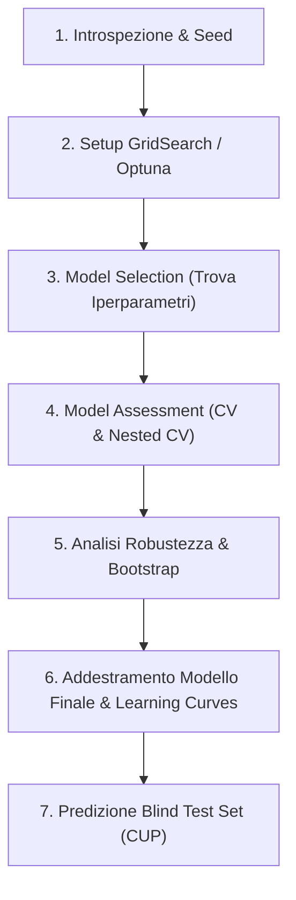
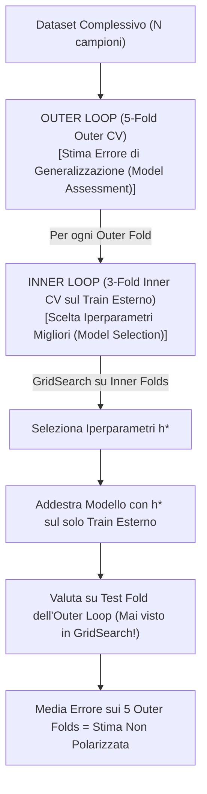

# Mappa Concettuale e Compendio delle Formule: Machine Learning
**Corso del Prof. Alessio Micheli — Università di Pisa**
*(Arricchito con le note d'esame, dimostrazioni Notion e Sezione Compendio per lo Scritto ed Orale)*

---

## 🗺️ Mappa Concettuale Globale

```mermaid
flowchart TD
    ML["MACHINE LEARNING"] --> P1["1. IL FRAMEWORK FONDAMENTALE\n(I 4 Elementi di ogni algoritmo)"]
    ML --> P2["2. APPRENDIMENTO SUPERVISIONATO\n(Modelli Lineari, NNs, SVM, k-NN)"]
    ML --> P3["3. VALIDAZIONE & STATISTICAL LEARNING THEORY\n(Bias-Varianza, SLT, VC-Dim, SRM)"]
    ML --> P4["4. ARCHITETTURE AVANZATE & UN-SUPERVISED\n(Autoencoder, RNN, SOM, GNN, Random NN)"]
    ML --> P5["5. GUIDA INTEGRALE AL CODICE DEL PROGETTO\n(File .py e Notebook .ipynb)"]
    ML --> P6["6. DOMANDE TRABOCCHETTO DELL'ORALE\n(Domande 'Spicy' di Micheli)"]
    ML --> P7["7. COMPENDIO ESAME SCRITTO & ORALE\n(8 Dimostrazioni Matematiche Complete)"]

    P1 --> F1["Dati X, y"]
    P1 --> F2["Spazio delle Ipotesi H"]
    P1 --> F3["Loss Function L"]
    P1 --> F4["Algoritmo di Ottimizzazione"]

    P2 --> M1["Modelli Lineari (Perceptron, LMS, Logistic)"]
    P2 --> M2["Reti Neurali Multi-layer (MLP & Backprop)"]
    P2 --> M3["Support Vector Machines (SVM & SVR)"]
    P2 --> M4["Instance-Based (k-NN)"]

    P3 --> V1["Bias-Variance-Noise Decomposition"]
    P3 --> V2["Schemi CV & Prevenzione Data Leakage"]
    P3 --> V3["VC-Dimension & Generalization Bounds"]
    P3 --> V4["Structural Risk Minimization (SRM)"]

    P4 --> A1["Deep Learning (CNN, RNN, Autoencoder)"]
    P4 --> A2["Algoritmi Costruttivi (Cascade Correlation)"]
    P4 --> A3["Random NN & Reservoir Computing"]
    P4 --> A4["SOM & Graph Neural Networks (Message Passing)"]

    P5 --> C1["File Python (.py): cross_common, nn_common, ecc."]
    P5 --> C2["Notebook MONK: monk_KNN, monk_SVM, monk_NN"]
    P5 --> C3["Notebook CUP: cup_KNN, cup_SVM, cup_NN, cup_Ensemble"]

    P6 --> T1["8 Domande Trabocchetto da Lode con Risposta Modello"]
    P7 --> D1["Dimostrazioni Passo-Passo (Backprop, Bias-Var, Perceptron, SVM, Radon)"]
```

---

# 📌 SEZIONE 1: Il Framework Fondamentale & Modelli Lineari

### 1. Il Framework dei 4 Elementi
* **Dati**: $D = \{(x_1, y_1), \dots, (x_N, y_N)\}$ dove $x_i \in \mathbb{R}^D$ e $y_i \in \mathcal{Y}$ (coppie input-target).
* **Spazio Ipotesi $\mathcal{H}$**: L'insieme di tutte le funzioni rappresentabili dal modello.
* **Loss Function $\mathcal{L}$**:
  * **MSE Loss**: $L_{MSE} = \frac{1}{N} \sum_{i=1}^N (y_i - \hat{y}_i)^2$ *(Nota di Micheli: N è il numero di coppie dato-target!)*
  * **MEE Loss (ML CUP)**: $L_{MEE} = \frac{1}{N} \sum_{i=1}^N \|\mathbf{y}_i - \hat{\mathbf{y}}_i\|_2 = \frac{1}{N} \sum_{i=1}^N \sqrt{\sum_{m=1}^K (y_{i,m} - \hat{y}_{i,m})^2}$
  * **BCE Loss**: $L_{BCE} = -\frac{1}{N} \sum_{i=1}^N \big[ y_i \log(\hat{y}_i) + (1-y_i) \log(1-\hat{y}_i) \big]$
* **Ottimizzazione**: Discesa del gradiente $w^{(t+1)} = w^{(t)} - \eta \nabla L(w)$.

---

### 2. Perceptron (LTU) & Teorema di Convergenza
* **Funzione di Attivazione a Gradino**: $f(x) = \text{sign}(w^T x + b)$.
* **Regola di Aggiornamento Pesi**: $w \leftarrow w + \eta (y_i - o_i) x_i$.
* **Teorema di Convergenza del Perceptron**: Se un dataset è linearmente separabile con un margine $\gamma > 0$ (ovvero esiste un peso $w^*$ tale che $y_i (w^{*T} x_i) \ge \gamma$), allora l'algoritmo convergerà commettendo al massimo un numero finito di errori:
  $$k \le \frac{R^2}{\gamma^2}$$
  dove $R = \max_i \|x_i\|$ è il raggio del dataset.

#### 💡 Domanda Frequente: Creare la porta NOT con 1 Perceptrone
* Input $x \in \{0, 1\}$, Target $y = 1 - x$.
* Pesi: $w = -2$, bias $b = 1$.
* Output: $f(x) = \text{sign}(-2x + 1)$. Se $x=0 \rightarrow \text{sign}(1)=+1$. Se $x=1 \rightarrow \text{sign}(-1)=-1$.

---

### 3. Funzioni di Attivazione e loro Proprietà
* **Sigmoide**: $\sigma(z) = \frac{1}{1 + e^{-z}}$. Derivata: $\sigma'(z) = \sigma(z)(1 - \sigma(z))$.
  * *Perché si usa invece del gradino?* È continua e **derivabile** (essenziale per la Backpropagation).
  * *Svantaggi*: Satura per $|z|$ grandi, causando il fenomeno del *Vanishing Gradient*.
* **ReLU (Rectified Linear Unit)**: $f(x) = \max(0, x)$.
  * Derivata: $f'(x) = 1$ se $x > 0$, $0$ se $x \le 0$.
  * *Significato della derivata (Domanda d'Esame)*: Agisce come una **maschera binaria (0/1)** basata sul valore di $net$, stabilendo quali neuroni trasmettono il flusso del gradiente all'indietro.
  * *Perché aiuta per il Vanishing Gradient?* Per $x > 0$ la derivata è esattamente 1, permettendo al gradiente di fluire inalterato senza degradarsi.
  * *Svantaggi*: "Dying ReLU" (se un neurone va sotto zero, la derivata vale 0 ed il peso non si aggiorna più). Alternative: LeakyReLU $f(x) = \max(\alpha x, x)$, GELU, ELU.
* **Perché NON usare solo attivazioni lineari?**
  * Se usassimo funzioni lineari $f(x) = c \cdot x$, la composizione di più strati collasserebbe algebricamente in un'unica trasformazione lineare finale $W_{tot} x$, perdendo tutta la capacità espressiva non lineare.

---

# 📌 SEZIONE 2: Reti Neurali & Backpropagation

### 1. Iperparametri dell'Aggiornamento dei Pesi
$$\Delta w(t) = -\eta \frac{\partial E}{\partial w(t)} + \alpha \Delta w(t-1) - \eta \lambda w(t)$$
* **$\eta$ (Learning Rate)**: Controlla la lunghezza del passo di discesa.
* **$\alpha$ (Momentum / Inerzia)**: Mantiene una frazione dell'aggiornamento dell'epoca precedente per smorzare le oscillazioni ed evitare minimi locali poco profondi.
* **$\lambda$ (Weight Decay / Regolarizzazione $L_2$)**: Aggiunge una sanzione $\frac{\lambda}{2} \|w\|^2$ alla loss, riducendo progressivamente la norma dei pesi per evitare l'overfitting.

---

### 2. Dimostrazione della Backpropagation (Derivazione dei $\delta$)
Vogliamo calcolare $\Delta_p w_{tu} = -\frac{\partial E_p}{\partial w_{tu}}$.

Usando la Chain Rule:
$$\Delta_p w_{tu} = -\frac{\partial E_p}{\partial net_t} \cdot \frac{\partial net_t}{\partial w_{tu}} = \delta_t \cdot o_u$$

I due casi per il calcolo di $\delta_t$:
* **Neurone di Output ($t = k$)**:
  $$\delta_k = -\frac{\partial E_p}{\partial o_k} \frac{\partial o_k}{\partial net_k} = (d_k - o_k) f'_k(net_k)$$
* **Neurone Nascosto ($t = j$)**:
  $$\delta_j = \left( \sum_{k} \delta_k w_{kj} \right) f'_j(net_j)$$
* **Fattorizzazione ed Efficienza**: Calcolare un solo $\delta_t$ per neurone riduce il costo computazionale da $O(|W|^2)$ a $O(|W|)$ (lineare nel numero di pesi!).

---

# 📌 SEZIONE 3: Support Vector Machines (SVM & SVR)

### 1. Hard Margin SVM (Margine Rigido)
* **Margine Geometrico**: $M = \frac{2}{\|w\|}$.
* **Formulazione Primate**:
  $$\min_{w, b} \frac{1}{2} \|w\|^2 \quad \text{sotto i vincoli } y_i(w^T x_i + b) \ge 1 \quad \forall i$$

---

### 2. Soft Margin SVM ($C$ e Slack Variables $\xi_i$)
* **Formulazione Primate**:
  $$\min_{w, b, \xi} \frac{1}{2} \|w\|^2 + C \sum_{i=1}^N \xi_i \quad \text{sotto i vincoli } y_i(w^T x_i + b) \ge 1 - \xi_i, \quad \xi_i \ge 0$$
* **Ruolo di $C$ (Domanda da Scritto/Orale)**:
  * $C \to \infty$: Penalizzazione massima degli errori $\rightarrow$ Margine stretto $\rightarrow$ **Rischio Overfitting**.
  * $C$ piccolo: Maggiore tolleranza per le violazioni $\rightarrow$ Margine ampio $\rightarrow$ **Regolarizzazione (Underfitting se troppo piccolo)**.

---

### 3. Formulazione Duale & Kernel Trick
* **Formulazione Duale**:
  $$\max_{\alpha} \sum_{i=1}^N \alpha_i - \frac{1}{2} \sum_{i=1}^N \sum_{j=1}^N \alpha_i \alpha_j y_i y_j K(x_i, x_j) \quad \text{sotto } 0 \le \alpha_i \le C, \,\, \sum \alpha_i y_i = 0$$
* **Sparsità KKT**: Solo i punti sul margine hanno $\alpha_i > 0$ (**Vettori di Supporto**).
* **Kernel RBF (Gaussiano)**:
  $$K(x, z) = \exp(-\gamma \|x - z\|^2)$$
  * $\gamma$ alto $\rightarrow$ raggio di influenza piccolo $\rightarrow$ **Overfitting**.
  * $\gamma$ basso $\rightarrow$ raggio di influenza ampio $\rightarrow$ **Underfitting**.

---

### 4. Support Vector Regression (SVR ed la $\epsilon$-Tube)
* **$\epsilon$-Insensitive Loss**:
  $$|y - f(x)|_\epsilon = \max(0, |y - f(x)| - \epsilon)$$
* L'errore è pari a zero se il punto rientra nel tubo di tolleranza $\pm \epsilon$ attorno alla funzione predetta.

---

# 📌 SEZIONE 4: Statistical Learning Theory (SLT) & Validazione

### 1. Dimostrazione della Decomposizione Bias-Varianza-Rumore
Dato $y = f(x) + \epsilon$ con $\mathbb{E}[\epsilon]=0$ e $\mathbb{E}[\epsilon^2]=\sigma^2$:
$$\mathbb{E}_{D, \epsilon} \big[ (y - h_D(x))^2 \big] = \underbrace{(f(x) - \bar{h}(x))^2}_{\text{Bias}(x)^2} + \underbrace{\mathbb{E}_D [ (h_D(x) - \bar{h}(x))^2 ]}_{\text{Varianza}(x)} + \underbrace{\sigma^2}_{\text{Rumore Irriducibile}}$$

---

### 2. VC-Dimension (Vapnik-Chervonenkis)
* **Shattering (Frammentazione)**: Un insieme di $N$ punti è shatterato da $\mathcal{H}$ se il modello può realizzare tutte le $2^N$ dicotomie (+1 / -1).
* **Definizione**: $VC(\mathcal{H})$ è la **massima cardinalità $N$** di punti shatterabili da $\mathcal{H}$.
* **VC-Dimension nei vari modelli**:
  * Iperpiani in $\mathbb{R}^D$ (Perceptron): $VC = D + 1$.
  * Reti Neurali: Cresce col numero di pesi $O(|W| \log |W|)$.
  * **SVM**: $VC \le \min\left(D, \frac{R^2}{\gamma^2}\right) + 1$. **NON dipende dalla dimensione $D$ dell'input**, ma dipende inversamente dal margine $\gamma$! (Ecco perché l'SVM evita la *curse of dimensionality*).
  * **1-NN**: $VC = \infty$ (memorizza qualsiasi dataset).

---

### 3. Structural Risk Minimization (SRM)
$$R(h) \le R_{emp}(h) + \Omega\left(\frac{h_{VC}}{N}\right)$$
* SRM organizza le ipotesi in strutture annidate $\mathcal{H}_1 \subset \mathcal{H}_2 \dots \subset \mathcal{H}_k$ e sceglie l'ipotesi che minimizza la somma dell'errore empirico e della confidenza VC.
* **Early Stopping come Regolarizzazione**: Limitando il numero di epoche, si limita implicitamente la norma dei pesi e la dimensione VC della rete!

---

# 📌 SEZIONE 5: Architetture Avanzate (Domande Scritte e Orali 2026)

### 1. Cascade Correlation (Algoritmo Costruttivo)
* **Principio**: Parte da una rete senza hidden unit e aggiunge un neurone alla volta **in cascata** (collegato all'input e a tutti i neuroni nascosti precedenti).
* **Funzione Obiettivo del Candidato**: Massimizzare la covarianza $S$ con l'errore residuo:
  $$S = \sum_k \left| \sum_p (o_p - \bar{o})(E_{p,k} - \bar{E}_k) \right|$$
* **Aggiornamento pesi del candidato**: Ascesa del gradiente $\Delta w_j = +\eta \frac{\partial S}{\partial w_j}$.
* **Congelamento (Frozen Weights)**: Una volta inserito il candidato, i suoi pesi d'ingresso vengono **congelati per sempre**, e si ri-addestrerà solo il layer di output.

---

### 2. Autoencoders (Undercomplete vs Overcomplete)
* **Undercomplete Autoencoder**: La dimensione dello strato nascosto $z$ (bottleneck) è **inferiore** all'input ($dim(z) < dim(x)$). Forzano la rete ad apprendere una rappresentazione latente compressa (simile alla PCA non lineare).
* **Overcomplete Autoencoder**: La dimensione dello strato nascosto è **superiore** all'input ($dim(z) > dim(x)$). Usati con regolarizzazione (es. Sparsity o Denoising) per apprendere feature ricche e ridondanti senza memorizzare l'input.

---

### 3. Random Neural Networks & Reservoir Computing (Echo State Networks)
* **Principio**: I pesi degli strati nascosti (o del bacino/reservoir) vengono **inizializzati casualmente e CONGELATI**.
* **Addestramento**: Si addestrano solo i pesi del layer di output tramite una semplice regressione lineare chiusa (LMS / Ridge Regression). Vantaggio: velocità di addestramento istantanea e assenza di minima locali.

---

### 4. Self-Organizing Maps (SOM di Kohonen)
* **Apprendimento Non Supervisionato Topologico**: Mappa dati ad alta dimensione su una griglia a 2D.
* **Regola di Aggiornamento del Neurone Vincitore (BMU) e dei Vicini**:
  $$w_i(t+1) = w_i(t) + \eta(t) h_{ic}(t) \big( x(t) - w_i(t) \big)$$
  dove $h_{ic}(t)$ è la funzione di vicinato gaussiana che decresce con la distanza dal BMU.

---

### 5. Graph Neural Networks (Message Passing)
* **Messaggio dal Vicinato**:
  $$m_v^{(k)} = \text{AGGREGATE}^{(k)} \left( \left\{ h_u^{(k-1)} : u \in N(v) \right\} \right)$$
* **Aggiornamento dello Stato del Nodo**:
  $$h_v^{(k)} = \text{UPDATE}^{(k)} \left( h_v^{(k-1)}, m_v^{(k)} \right)$$

---

### 6. Fenomeni Moderni: Double Descent & Lottery Ticket Hypothesis
* **Double Descent**: All'aumentare della complessità del modello, l'errore di test prima decresce, poi sale vicini al limite di interpolazione (overfitting classico), e poi **scende di nuovo** quando il modello diventa fortemente sopra-parametrizzato (over-parametrized regime).
* **Lottery Ticket Hypothesis (Frankle & Carbin)**: All'interno di una rete neurale grande inizializzata casualmente, esiste una sottorete ("biglietto vincente") che, se addestrata da sola con i pesi iniziali originari, raggiunge prestazioni pari all'intera rete in tempi minori.

---

# 📌 SEZIONE 6: Guida Integrale al Codice del Progetto (File per File)

Di seguito trovi la spiegazione dettagliata di come la teoria del corso è stata trasformata nel codice sorgente del repository del vostro gruppo.

---

### 6.1 I File Python di Supporto (`.py`)

#### 1. `cross_common.py` — *Motore di Validazione, Metriche e Nested CV*
* **Metriche**: Definisce le stringhe delle metriche (`MEE`, `MSE`, `RMSE`, `MAE`, `R2`) e la funzione `cr.mee` per calcolare il Mean Euclidean Error 4D per la CUP.
* **Prevenzione del Data Leakage (`SklearnRegressorRunner` e `SklearnNestedRegressorRunner`)**:
  * Incapsula i modelli di Scikit-Learn. Ad ogni fold del K-Fold, clona la pipeline ed esegue il `fit` **solo sul training fold del corrente K-Fold**, ed il `transform` sul validation fold. In questo modo lo scaling (`RobustScaler` / `StandardScaler`) non "vede" mai i dati di validazione in anticipo.
* **`kfold()` per Scikit-Learn**: Cicla sui fold, esegue l'addestramento ed estrae le metriche sia di Train che di Validation.
* **Nested Cross-Validation (`assess_sklearn_cv_robustness`)**:
  * Implementa il doppio ciclo (Inner Loop per la ricerca iperparametri con GridSearch, Outer Loop per la stima dell'errore di generalizzazione non polarizzato su fold esterni non usati nella scelta del modello).
* **Bootstrap (`generate_bootstrap_samples`)**: Genera campioni con reinserimento per stimare empiricamente l'intervallo di confidenza delle metriche.

#### 2. `nn_common.py` — *Architettura Rete Neurale PyTorch e Training Loop Custom*
* **`MLP(nn.Module)`**: Classe della rete neurale PyTorch. Costruisce una sequenza di layer lineari (`nn.Linear`) con attivazioni (`ReLU`, `Tanh`, `GELU`) ed accoppia un `OutputAdapter`.
* **`OutputAdapter`**:
  * `binary_bce_adapter`: Per MONK (classificazione binaria). Applica la Sigmoide ed esegue il thresholding $\ge 0.5$.
  * `regression_adapter`: Per la CUP (regressione multivariata 4D). Applica l'attivazione Identità $f(x) = x$.
* **`MEELoss(nn.Module)`**: Loss PyTorch personalizzata che calcola direttamente la distanza euclidea vettoriale $\frac{1}{N} \sum \|\hat{y} - y\|_2$ per permettere la retropropagazione diretta del MEE durante il backpropagation.
* **`train(...)` — Il Loop di Addestramento PyTorch Custom**:
  * Cicla per `epochs` epoche. Ad ogni batch:
    1. `optimizer.zero_grad()` per azzerare i gradienti accumulati.
    2. Forward pass: `output = model.forward(X)`.
    3. Calcolo della loss ed esecuzione del `loss.backward()`.
    4. Tracciamento della norma del gradiente (`gradient_norm(model)`).
    5. Aggiornamento pesi con `optimizer.step()`.
  * **Early Stopping (`EarlyStoppingStrategy`)**: Controlla la loss di validazione ad ogni epoca. Se per `patience` epoche la loss non migliora di almeno `min_delta`, interrompe l'addestramento e **ripristina i pesi salvati nello stato migliore (`best_state`)**.
  * **Learning Rate Decay**: Gestito tramite `ReduceLROnPlateau` che dimezza il tassi di apprendimento quando la loss sul validation stagna.
* **`kfold()` per PyTorch**: Applica la K-Fold Cross Validation alle reti PyTorch usando `ManualSplitStrategy`.

#### 3. `monk_common.py` e `cup_common.py` — *Data Loaders*
* **`monk_common.py`**: Carica i file dei 3 problemi MONK. Converte i 6 attributi simbolici $a_1 \dots a_6$ in **17 colonne binarie (0/1)** usando `pd.get_dummies` (1-of-k / One-Hot Encoding).
* **`cup_common.py`**: Carica `ML-CUP25-TR.csv` (500 campioni, 12 feature, 4 target) e `ML-CUP25-TS.csv` (1000 campioni del blind test). Gestisce la separazione feature/target e l'applicazione corretta dello scaling.

#### 4. `svm_common.py` e `knn_common.py` — *Helper Analitici*
* **`svm_common.py`**: Contiene `compare_svfreq_vs_permutation(...)` che confronta quali feature diventano più frequentemente Vettori di Supporto ($\alpha_i > 0$) rispetto alla *Permutation Importance* calcolata permutando le colonne.
* **`knn_common.py`**: Contiene `plot_knn_learning_curves_grid(...)` per plottare in una griglia di subplot l'andamento dell'errore al variare del numero dei vicini $k$.

---

### 6.2 I Notebook Jupyter del Progetto (`notebooks/`)

Tutti i notebook seguono un **flusso di lavoro rigoroso in 7 passaggi**:

#### A) I Notebook per MONK (Classificazione)
1. **`monk_KNN.ipynb`**: Valuta KNN sui 3 problemi MONK. Risolve MONK-1 al 100% con $k=1$, ma mostra che **KNN fatica su MONK-2** (~75% accuracy) perché la regola di conteggio globale non è cogliibile dalle metriche di distanza locali.
2. **`monk_SVM.ipynb`**: Applica le SVM. Con kernel polinomiale di grado 2 o RBF risolve **al 100% sia MONK-1 che MONK-2**. L'analisi della frequenza dei Support Vector dimostra che gli attributi $a_1, a_2, a_5$ sono quelli guida.
3. **`monk_NN_optuna.ipynb`**: Esplora lo spazio degli iperparametri della Rete Neurale PyTorch con Optuna (cercando architettura, learning rate, weight decay).
4. **`monk_NN_1.ipynb`**: **Il Notebook di Collaudo Richiesto da Micheli**. Addestra una piccola rete PyTorch (2-4 neuroni nascosti) su MONK-1 raggiungendo il **100.0% di Accuracy sia in Train che in Test** con convergenza fluida.
5. **`monk_NN_2.ipynb`** e **`monk_NN_3.ipynb`**: Completano l'addestramento ed i plot delle reti neurali sui problemi MONK-2 e MONK-3 (gestendo il rumore tramite regolarizzazione).

#### B) I Notebook per la ML CUP (Regressione Multivariata 4D)
1. **`cup_data_introspection.ipynb`**: Analizza il dataset della CUP (500 righe, 12 input, 4 target). Calcola il modello di riferimento banale (**`DummyRegressor`**), che predice la media dei target ed ottiene un **MEE Baseline di 35.79**.
2. **`cup_KNN.ipynb`**: KNN Regressor con `RobustScaler` e $k=3$. Ottiene un **MEE in CV di 16.07** (miglior modello classico).
3. **`cup_LinearSVR.ipynb`**: SVR Lineare. Ottiene un MEE di **25.50**, dimostrando l'assoluta necessità di passare a kernel non lineari.
4. **`cup_SVM.ipynb`**: SVR con Kernel RBF. Ottimizzando $C$, $\gamma$ ed $\epsilon$, ottiene un MEE di **20.98**.
5. **`cup_NN_optuna.ipynb`**: Esegue la ricerca Bayesiana con Optuna per la Rete Neurale sulla CUP. Trova che un'architettura a 2 layer nascosti `[256, 128]`, attivazione `tanh`, ottimizzatore `AdamW` e regolarizzazione $L_2$ raggiunge le prestazioni migliori.
6. **`cup_NN_manual.ipynb`**: Addestra la Rete Neurale finale PyTorch sulla CUP per tracciare le **Learning Curves** (loss ed MEE in funzione delle epoche) ed escludere overfitting.
7. **`cup_Ensemble.ipynb`**: Esperimento avanzato di **Ensemble Modeling** che combina le predizioni di più modelli (Rete Neurale + SVR + KNN) per ridurre la varianza e produrre il file finale `Celati_Degliotti_Melaccio_ML-CUP25-TS.csv`.

---

# 📌 SEZIONE 7: Domande Trabocchetto dell'Orale di Micheli (con Risposte Modello)

Di seguito trovi le **8 domande "spicy" più frequenti all'orale** con la risposta ideale da dare a voce per dimostrare il massimo livello di maturità scientifica.

---

### ❓ Q1: *"Perché nella regressione la Softmax non ha senso e si usa l'attivazione Identità?"*
* **Risposta Modello**: *"La funzione Softmax converte un vettore di logits in una distribuzione di probabilità i cui elementi sommano a 1, il che è perfetto per la classificazione multi-classe. Nella regressione (come per i 4 target della CUP), vogliamo stimare valori reali continui non vincolati ad una somma unitaria o ad un intervallo limitato $[0, 1]$, per cui l'output layer deve usare l'attivazione Identità $f(x) = x$."*

---

### ❓ Q2: *"Cos'è la Matrice di Gram nelle SVM e perché deve essere Semidefinita Positiva?"*
* **Risposta Modello**: *"La Matrice di Gram $G_{ij} = K(x_i, x_j)$ raccoglie i prodotti scalari trasformativi tra tutti i punti del dataset. Dal Teorema di Mercer, la condizione che $G$ sia semidefinita positiva ($v^T G v \ge 0 \,\, \forall v$) garantisce che la funzione obiettivo della formulazione duale sia strettamente convessa. Ciò assicura che il problema di programmazione quadratica ammetta UN SOLO MINIMO GLOBALE senza minimi locali."*

---

### 3️⃣ Q3: *"Perché la regola di aggiornamento pesi nella Cascade Correlation usa il segno PLUS ($+\eta \frac{\partial S}{\partial w}$)?"*
* **Risposta Modello**: *"Perché anziché minimizzare una funzione di perdita (dove si usa la discesa del gradiente col segno meno $-\eta \frac{\partial E}{\partial w}$), nella Cascade Correlation l'obiettivo del candidato è MASSIMIZZARE la covarianza $S$ con l'errore residuo della rete. Di conseguenza, l'aggiornamento dei pesi del candidato usa l'ascesa del gradiente col segno $+$. "*

---

### 4️⃣ Q4: *"Perché l'Early Stopping può essere formalmente considerato una forma di regolarizzazione di Tikhonov ($L_2$)?"*
* **Risposta Modello**: *"Arrestare l'addestramento ad un numero limitato di epoche $T$ impedisce ai pesi di crescere verso valori di norma elevati, limitando la loro magnitudo $\|w\|^2$. Questo agisce esattamente come il termine di penalità della regolarizzazione di Tikhonov $\frac{\lambda}{2} \|w\|^2$, riducendo la capacità teorica e la dimensione VC della rete."*

---

### 5️⃣ Q5: *"Perché la VC-Dimension di 1-NN è infinita, ma 1-NN può comunque generalizzare?"*
* **Risposta Modello**: *"1-NN memorizza perfettamente l'intero dataset creando tassellature di Voronoi attorno ad ogni punto. Ha $VC = \infty$ perché può separare qualsiasi combinazione di etichette $2^N$ su $N$ punti se distanziati. Tuttavia, la sua capacità di generalizzare su dati futuri non dipende da un vincolo sulla capacità dello spazio delle ipotesi, ma dalla liscia continuità della vera funzione target $f(x)$ sottostante (se punti vicini nello spazio delle feature appartengono alla stessa classe)."*

---

### 6️⃣ Q6: *"Perché l'inizializzazione dei pesi a zero distrugge l'addestramento di una Rete Neurale?"*
* **Risposta Modello**: *"Se tutti i pesi di un layer hidden vengono inizializzati a zero (o a qualsiasi valore costante uguale), tutti i neuroni dello strato calcoleranno esattamente lo stesso valore di attivazione $net$ nel forward pass e riceveranno esattamente lo stesso segnale d'errore $\delta$ durante il backpropagation. I pesi si aggiorneranno tutti della stessa quantità, mantenendo i neuroni identici tra loro ad ogni epoca e distruggendo la capacità della rete di apprendere feature differenti (rottura della simmetria dei gradienti)."*

---

### 7️⃣ Q7: *"Che cos'è la rappresentazione latente in un Autoencoder Undercomplete?"*
* **Risposta Modello**: *"È la codifica compressa a dimensionalità ridotta prodotta dallo strato intermedio bottleneck $z$ ($dim(z) < dim(x)$). Costringe la rete a scartare il rumore e la ridondanza dell'input, estraendo solo le feature latenti essenziali necessarie per ricostruire il dato originale nella fase di decoding."*

---

### 8️⃣ Q8: *"Perché lo scaling (es. StandardScaler o RobustScaler) va inserito dentro la Pipeline del K-Fold e non calcolato prima?"*
* **Risposta Modello**: *"Se calcolassimo la media e la deviazione standard sull'intero dataset prima della Cross-Validation, le informazioni del Validation set influenzerebbero la normalizzazione dei dati di addestramento. Questo genererebbe Data Leakage (contaminazione dei dati), portando a stime di errore ottimistiche e non veritiere. Inserendo lo scaler dentro la Pipeline, il `fit_transform` viene calcolato ESCLUSIVAMENTE sul training fold di ogni singolo ciclo."*

---

# 📌 SEZIONE 8: Compendio d'Esame — Domande Tipiche con Dimostrazioni Matematiche Complete

Di seguito sono riportate le **8 domande matematiche più importanti dello scritto e dell'orale**, svolte con tutti i passaggi algebrici rigorosi.

---

### 📐 D1: Dimostrazione Formale della Backpropagation (Chain Rule e Derivazione dei $\delta$)

**Domanda**: *"Derivare la regola di aggiornamento pesi $\Delta w_{tu}$ per un neurone generico usando la chain rule della propagazione all'indietro dell'errore. Distinguere il caso in cui $t$ sia un neurone di output rispetto ad un neurone nascosto."*

#### 1. Definizione dell'Errore e della Chain Rule
Per un singolo pattern $p$, definiamo l'errore quadratico medio:
$$E_p = \frac{1}{2} \sum_{k \in \text{Output}} (d_{p,k} - o_{p,k})^2$$

Il net input al neurone $t$ è dato dalla somma pesata delle uscite del layer precedente:
$$net_t = \sum_u w_{tu} o_u$$

L'uscita del neurone $t$ è $o_t = f_t(net_t)$. Applicando la Chain Rule per calcolare la derivata rispetto al peso $w_{tu}$:
$$\frac{\partial E_p}{\partial w_{tu}} = \frac{\partial E_p}{\partial net_t} \cdot \frac{\partial net_t}{\partial w_{tu}}$$

Poiché $\frac{\partial net_t}{\partial w_{tu}} = o_u$, definendo il **local error factor** $\delta_t = -\frac{\partial E_p}{\partial net_t}$, otteniamo:
$$\Delta w_{tu} = -\eta \frac{\partial E_p}{\partial w_{tu}} = \eta \delta_t o_u$$

#### 2. Caso A: Neurone $t$ nel Layer di Output ($t = k$)
L'errore $E_p$ dipende direttamente da $o_k$. Usiamo nuovamente la Chain Rule:
$$\delta_k = -\frac{\partial E_p}{\partial net_k} = -\frac{\partial E_p}{\partial o_k} \cdot \frac{\partial o_k}{\partial net_k}$$

* Derivata della loss rispetto all'output: $\frac{\partial E_p}{\partial o_k} = \frac{\partial}{\partial o_k} \frac{1}{2}(d_k - o_k)^2 = -(d_k - o_k)$.
* Derivata dell'output rispetto al net: $\frac{\partial o_k}{\partial net_k} = f'_k(net_k)$.

Sostituendo:
$$\delta_k = - \big( -(d_k - o_k) \big) f'_k(net_k) = (d_k - o_k) f'_k(net_k)$$

#### 3. Caso B: Neurone $t$ nel Layer Nascosto ($t = j$)
Un neurone nascosto $j$ influenza l'errore $E_p$ attraverso **tutti i neuroni $k$ del layer di output a cui è connesso**. Usiamo la derivata parziale multivariata:
$$\delta_j = -\frac{\partial E_p}{\partial net_j} = -\sum_{k \in \text{Output}} \frac{\partial E_p}{\partial net_k} \cdot \frac{\partial net_k}{\partial o_j} \cdot \frac{\partial o_j}{\partial net_j}$$

Riconoscendo che $-\frac{\partial E_p}{\partial net_k} = \delta_k$, che $\frac{\partial net_k}{\partial o_j} = \frac{\partial}{\partial o_j} \sum_j w_{kj} o_j = w_{kj}$, e che $\frac{\partial o_j}{\partial net_j} = f'_j(net_j)$:
$$\delta_j = \left( \sum_{k \in \text{Output}} \delta_k w_{kj} \right) f'_j(net_j)$$

---

### 📐 D2: Dimostrazione Algebrica della Scomposizione Bias-Varianza-Rumore

**Domanda**: *"Derivare analiticamente la decomposizione dell'Errore Quadratico Medio Atteso $\mathbb{E}[(y - h_D(x))^2]$ nelle componenti di Bias al quadrato, Varianza e Rumore Irriducibile."*

#### 1. Modello di Generazione dei Dati
Sia $y = f(x) + \epsilon$, dove $f(x)$ è la vera funzione target e $\epsilon$ è un rumore stocastico a media nulla e varianza $\sigma^2$:
$$\mathbb{E}[\epsilon] = 0, \quad \mathbb{E}[\epsilon^2] = \sigma^2, \quad \mathbb{E}[f(x)\epsilon] = 0$$

Sia $h_D(x)$ il modello appreso da un dataset $D$, e sia $\bar{h}(x) = \mathbb{E}_D[h_D(x)]$ la media delle predizioni su tutti i possibili dataset.

#### 2. Riscrittura dello Scarto
Espandiamo il termine di errore $y - h_D(x)$ sommando e sottrando $\bar{h}(x)$:
$$y - h_D(x) = (f(x) + \epsilon) - h_D(x) = \underbrace{(f(x) - \bar{h}(x))}_{\text{A}} + \underbrace{(\bar{h}(x) - h_D(x))}_{\text{B}} + \underbrace{\epsilon}_{\text{C}}$$

#### 3. Calcolo del Valore Atteso del Quadrato $\mathbb{E}_{D, \epsilon} \big[ (A + B + C)^2 \big]$
$$(A + B + C)^2 = A^2 + B^2 + C^2 + 2AB + 2AC + 2BC$$

Calcoliamo il valore atteso termine per termine:
1. $\mathbb{E}_D [A^2] = \mathbb{E}_D [(f(x) - \bar{h}(x))^2] = (f(x) - \bar{h}(x))^2 = \text{Bias}(x)^2$ *(è una costante rispetto al dataset $D$)*.
2. $\mathbb{E}_D [B^2] = \mathbb{E}_D [(\bar{h}(x) - h_D(x))^2] = \text{Varianza}(x)$ *(definizione di varianza della stima)*.
3. $\mathbb{E}_\epsilon [C^2] = \mathbb{E}[\epsilon^2] = \sigma^2$ *(rumore irriducibile)*.
4. $2 \mathbb{E}_D [AB] = 2(f(x) - \bar{h}(x)) \mathbb{E}_D [\bar{h}(x) - h_D(x)] = 2(f(x) - \bar{h}(x)) (\bar{h}(x) - \bar{h}(x)) = 0$.
5. $2 \mathbb{E}_{D,\epsilon} [AC] = 2(f(x) - \bar{h}(x)) \mathbb{E}[\epsilon] = 0$.
6. $2 \mathbb{E}_{D,\epsilon} [BC] = 2 \mathbb{E}_D [\bar{h}(x) - h_D(x)] \mathbb{E}[\epsilon] = 0$.

Sommando i termini non nulli otteniamo la scomposizione esatta:
$$\mathbb{E}_{D, \epsilon} \big[ (y - h_D(x))^2 \big] = \text{Bias}(x)^2 + \text{Varianza}(x) + \sigma^2$$

---

### 📐 D3: Dimostrazione del Teorema di Convergenza del Perceptrone

**Domanda**: *"Enunciare e dimostrare il Teorema di Convergenza del Perceptrone per dataset linearmente separabili."*

#### 1. Ipotesi
Sia $D = \{(x_1, y_1), \dots, (x_N, y_N)\}$ con $y_i \in \{-1, +1\}$ un dataset **linearmente separabile con margine $\gamma > 0$**.
Ciò significa che esiste un vettore pesi ideale $w^*$ unitario ($\|w^*\| = 1$) tale che:
$$y_i (w^{*T} x_i) \ge \gamma > 0 \quad \forall i=1 \dots N$$

Sia $R = \max_i \|x_i\|$ la massima norma degli esempi di input.
Sia $w_0 = 0$ il vettore pesi iniziale. La regola di aggiornamento all'errore $k$-esimo è $w_k = w_{k-1} + y_i x_i$.

#### 2. Dimostrazione del Limite Inferiore sul Prodotto Scalare $w_k^T w^*$
Consideriamo il prodotto scalare $w_k^T w^*$:
$$w_k^T w^* = (w_{k-1} + y_i x_i)^T w^* = w_{k-1}^T w^* + y_i (x_i^T w^*)$$

Poiché $y_i (w^{*T} x_i) \ge \gamma$, applicando la relazione ricorsivamente per $k$ aggiornamenti:
$$w_k^T w^* \ge w_{k-1}^T w^* + \gamma \ge w_{k-2}^T w^* + 2\gamma \dots \ge k \gamma$$
$$\implies w_k^T w^* \ge k \gamma \quad \text{(1)}$$

#### 3. Dimostrazione del Limite Superiore sulla Norma $\|w_k\|^2$
Consideriamo la norma al quadrato $\|w_k\|^2$:
$$\|w_k\|^2 = \|w_{k-1} + y_i x_i\|^2 = \|w_{k-1}\|^2 + 2 y_i (w_{k-1}^T x_i) + \|x_i\|^2$$

Poiché l'aggiornamento avviene **solo quando il Perceptrone commette un errore**, abbiamo $y_i (w_{k-1}^T x_i) \le 0$. Inoltre $\|x_i\|^2 \le R^2$:
$$\|w_k\|^2 \le \|w_{k-1}\|^2 + 0 + R^2 \le \|w_{k-2}\|^2 + 2 R^2 \dots \le k R^2$$
$$\implies \|w_k\| \le \sqrt{k} R \quad \text{(2)}$$

#### 4. Conclusione tramite Disuguaglianza di Cauchy-Schwarz
Per la disuguaglianza di Cauchy-Schwarz: $w_k^T w^* \le \|w_k\| \|w^*\| = \|w_k\|$ (dato che $\|w^*\|=1$).
Combinando le disuguaglianze (1) e (2):
$$k \gamma \le w_k^T w^* \le \|w_k\| \le \sqrt{k} R$$
$$k \gamma \le \sqrt{k} R \implies k^2 \gamma^2 \le k R^2 \implies k \le \frac{R^2}{\gamma^2}$$

Il numero massimo di errori $k$ prima di raggiungere la convergenza perfetta è **finito e limitato superiormente da $\frac{R^2}{\gamma^2}$**.

---

### 📐 D4: Support Vector Machines — Dal Margine Geometrico alla Formulazione Duale

**Domanda**: *"Ricavare il margine geometrico $M = \frac{2}{\|w\|}$, impostare il problema di ottimizzazione per le Soft Margin SVM e ricavare la formulazione duale tramite la Lagrangiana."*

#### 1. Derivazione del Margine Geometrico
Un iperpiano separatore è definito da $w^T x + b = 0$. La distanza ortogonale di un punto $x_i$ dall'iperpiano è $d_i = \frac{|w^T x_i + b|}{\|w\|}$.
Per garantire la corretta classificazione con margine, imponiamo la condizione di separazione canonica per i vettori di supporto:
$$y_i (w^T x_i + b) \ge 1$$
La distanza dei punti più vicini (Support Vectors) dall'iperpiano è $\frac{1}{\|w\|}$. La larghezza totale della fascia di margine tra le due classi è dunque:
$$M = \frac{2}{\|w\|}$$
Massimizzare il margine $M$ equivale a minimizzare $\|w\|$, ovvero minimizzare $\frac{1}{2} \|w\|^2$.

#### 2. Formulazione Primate Soft Margin (con Slack Variables $\xi_i$)
Per tollerare punti non linearmente separabili dentro il margine o errati, introduciamo le slack variables $\xi_i \ge 0$:
$$\min_{w, b, \xi} \frac{1}{2} \|w\|^2 + C \sum_{i=1}^N \xi_i \quad \text{sotto i vincoli } y_i(w^T x_i + b) \ge 1 - \xi_i, \quad \xi_i \ge 0$$

#### 3. Derivazione della Formulazione Duale
Costruiamo la funzione Lagrangiana con moltiplicatori $\alpha_i \ge 0$ e $\mu_i \ge 0$:
$$\mathcal{L}(w, b, \xi, \alpha, \mu) = \frac{1}{2} \|w\|^2 + C \sum_{i=1}^N \xi_i - \sum_{i=1}^N \alpha_i \big[ y_i(w^T x_i + b) - 1 + \xi_i \big] - \sum_{i=1}^N \mu_i \xi_i$$

Azzeriamo le derivate parziali rispetto alle variabili primali $(w, b, \xi_i)$:
1. $\frac{\partial \mathcal{L}}{\partial w} = w - \sum_{i=1}^N \alpha_i y_i x_i = 0 \implies w = \sum_{i=1}^N \alpha_i y_i x_i$
2. $\frac{\partial \mathcal{L}}{\partial b} = \sum_{i=1}^N \alpha_i y_i = 0$
3. $\frac{\partial \mathcal{L}}{\partial \xi_i} = C - \alpha_i - \mu_i = 0 \implies \alpha_i \le C$

Sostituendo queste tre relazioni nella Lagrangiana ed effettuando i passaggi algebrici, le componenti con $w$ e $\xi$ si semplificano, ottenendo la **Formulazione Duale**:
$$\max_{\alpha} \sum_{i=1}^N \alpha_i - \frac{1}{2} \sum_{i=1}^N \sum_{j=1}^N \alpha_i \alpha_j y_i y_j (x_i^T x_j) \quad \text{sotto } 0 \le \alpha_i \le C \text{ e } \sum_{i=1}^N \alpha_i y_i = 0$$

Sostituendo il prodotto scalare $x_i^T x_j$ con una funzione Kernel $K(x_i, x_j)$ si applica il **Kernel Trick**.

---

### 📐 D5: Cascade Correlation — Covarianza del Candidato e Congelamento dei Pesi

**Domanda**: *"Fornire l'espressione matematica della funzione obiettivo $S$ usata per addestrare un neurone candidato nella Cascade Correlation, derivare il suo gradiente e spiegare perché i pesi d'ingresso vengono congelati."*

#### 1. Funzione Obiettivo di Covarianza $S$
Nella Cascade Correlation, un neurone candidato $c$ riceve input da tutte le feature d'ingresso e da tutti i neuroni nascosti preesistenti. L'obiettivo è **massimizzare la covarianza $S$** tra l'uscita del candidato $o_p$ e l'errore residuo del layer di output $E_{p,k}$ su tutti i pattern $p$ ed i target $k$:
$$S = \sum_{k \in \text{Output}} \left| \sum_{p} (o_p - \bar{o})(E_{p,k} - \bar{E}_k) \right|$$
dove $\bar{o} = \frac{1}{N} \sum_p o_p$ è l'uscita media del candidato e $\bar{E}_k = \frac{1}{N} \sum_p E_{p,k}$ è l'errore medio sul target $k$.

#### 2. Ascesa del Gradiente
Per massimizzare $S$, eseguiamo l'ascesa del gradiente sui pesi d'ingresso $w_{j}$ del candidato:
$$\Delta w_{j} = +\eta \frac{\partial S}{\partial w_{j}}$$

Sia $\sigma_k = \text{sign}\left( \sum_{p} (o_p - \bar{o})(E_{p,k} - \bar{E}_k) \right)$ il segno della covarianza per il target $k$. Derivando rispetto a $w_j$:
$$\frac{\partial S}{\partial w_{j}} = \sum_{k} \sigma_k \sum_{p} (E_{p,k} - \bar{E}_k) f'_p(net_c) x_{p,j}$$

#### 3. Congelamento dei Pesi (Frozen Weights)
Una volta completato l'addestramento del candidato e massimizzata la covarianza $S$, il neurone viene inserito stabilmente nella rete ed **i suoi pesi d'ingresso vengono congelati per sempre**.
* **Motivazione teorica**: Evita il fenomeno del *moving target problem* (in cui i neuroni nascosti continuano a cambiare ruolo destabilizzando gli altri strati) e garantisce che ogni neurone agisca come un estrattore di feature permanente.

---

### 📐 D6: Support Vector Regression (SVR) ed $\epsilon$-Insensitive Loss

**Domanda**: *"Scrivere la funzione di perdita $\epsilon$-insensitive della SVR, impostare il problema di ottimizzazione con le variabili slack $(\xi_i, \xi_i^*)$ e chiarire le differenze rispetto alla loss MSE."*

#### 1. La $\epsilon$-Insensitive Loss
A differenza della regressione classica con MSE, la SVR utilizza la loss $\epsilon$-insensitive $|y - f(x)|_\epsilon$:
$$L_\epsilon(y, f(x)) = |y - f(x)|_\epsilon = \begin{cases} 0 & \text{se } |y - f(x)| \le \epsilon \\ |y - f(x)| - \epsilon & \text{altrimenti} \end{cases}$$
L'errore è pari a zero se il punto cade all'interno di un tubo ("tube") di ampiezza $\pm \epsilon$ attorno alla funzione di regressione predetta $f(x) = w^T x + b$.

#### 2. Formulazione Primate con Slack Variables $(\xi_i, \xi_i^*)$
Poiché le deviazioni possono avvenire sia al di sopra ($\xi_i$) che al di sotto ($\xi_i^*$) del tubo di tolleranza $\epsilon$:
$$\min_{w, b, \xi, \xi^*} \frac{1}{2} \|w\|^2 + C \sum_{i=1}^N (\xi_i + \xi_i^*)$$
$$\text{sotto i vincoli: } \begin{cases} y_i - (w^T x_i + b) \le \epsilon + \xi_i \\ (w^T x_i + b) - y_i \le \epsilon + \xi_i^* \\ \xi_i \ge 0, \,\, \xi_i^* \ge 0 \end{cases}$$

#### 3. Confronto SVR ($\epsilon$-insensitive) vs MSE
* **MSE ($L_2$)**: Penalizza tutti i residui in modo quadratico. Un singolo punto isolato lontano (outlier) ha un impatto enorme ed attrae a sé la curva di regressione.
* **SVR ($\epsilon$-insensitive)**: Ignora le piccole fluttuazioni minori di $\epsilon$ (garantendo la **sparsità dei Support Vector**) e penalizza i residui esterni in modo **lineare**, garantendo una forte robustezza agli outlier.

---

### 📐 D7: Nested Cross-Validation (Doppio Ciclo per Model Selection & Assessment)

**Domanda**: *"Spiegare l'architettura della Nested Cross-Validation, il ruolo dei due cicli Inner ed Outer loop e perché la CV semplice porta ad una stima polarizzata dell'errore."*

#### 1. Limite della Cross-Validation Semplice
Se utilizziamo la K-Fold Cross Validation sia per selezionare la combinazione di iperparametri migliore $h^*$ sia per riportare l'errore finale, l'errore riportato sul validation set per $h^*$ soffre di **overfitting da ricerca iper-parametri** (*selection bias*). La stima dell'errore risulterà ottimistica (polarizzata).

#### 2. Architettura della Nested Cross-Validation
Per eliminare la polarizzazione si separano nettamente i due processi con due cicli annidati:
1. **Outer Loop (es. 5-Fold)**: Divide il dataset originale in 5 blocchi. In ogni iterazione, 1 blocco viene congelato come **Test Set Esterno** e 4 blocchi costituiscono il **Training Set Esterno**.
2. **Inner Loop (es. 3-Fold)**: Prende il solo Training Set Esterno e lo suddivide ulteriormente per eseguire la GridSearch o l'ottimizzazione degli iperparametri, trovando la configurazione migliore $h^*$.
3. **Valutazione Non Polarizzata**: Si ri-addestra il modello con $h^*$ sull'intero Training Set Esterno e lo si valuta sul **Test Set Esterno** (che non ha partecipato alla scelta degli iperparametri).
4. La media dell'errore sui 5 Test Set Esterni costituisce la reale stima non polarizzata delle prestazioni di generalizzazione.

---

### 📐 D8: Dimostrazione Formale della VC-Dimension degli Iperpiani in $\mathbb{R}^D$ ($VC = D+1$)

**Domanda**: *"Dimostrare formalmente che la VC-dimension degli iperpiani lineari in $\mathbb{R}^D$ è pari a $D+1$ usando il Teorema di Radon."*

#### 1. Parte I: Shattering di $D+1$ Punti (Limite Inferiore $VC \ge D+1$)
Dobbiamo mostrare che esiste ALMENO UN insieme di $D+1$ punti in $\mathbb{R}^D$ che può essere shatterato (ovvero che ammette tutte le $2^{D+1}$ dicotomie).

Scegliamo i seguenti $D+1$ punti canonici:
$$x_0 = (0, 0, \dots, 0)^T$$
$$x_1 = (1, 0, \dots, 0)^T, \quad x_2 = (0, 1, \dots, 0)^T, \quad \dots \quad x_D = (0, 0, \dots, 1)^T$$

Per qualsiasi assegnamento arbitrario di etichette $y_0, y_1, \dots, y_D \in \{-1, +1\}$, possiamo definire i parametri dell'iperpiano $w = (w_1, \dots, w_D)^T$ e $b$ come segue:
* Scegliamo $b = y_0$.
* Scegliamo $w_i = y_i - y_0$ per $i = 1 \dots D$.

Verifichiamo le predizioni $\text{sign}(w^T x_i + b)$:
* Per $x_0$: $\text{sign}(w^T x_0 + b) = \text{sign}(0 + b) = \text{sign}(y_0) = y_0$.
* Per $x_i$ ($i \ge 1$): $\text{sign}(w^T x_i + b) = \text{sign}(w_i + b) = \text{sign}((y_i - y_0) + y_0) = \text{sign}(y_i) = y_i$.

Poiché l'iperpiano può realizzare qualunque combinazione di etichette per questi $D+1$ punti, l'insieme è shatterato $\implies VC(\mathcal{H}) \ge D+1$.

#### 2. Parte II: Impossibilità di Shatterare $D+2$ Punti (Limite Superiore $VC < D+2$)
Dobbiamo mostrare che NESSUN insieme di $D+2$ punti in $\mathbb{R}^D$ può essere shatterato.

**Teorema di Radon**: Ogni insieme di $D+2$ punti $S = \{x_1, \dots, x_{D+2}\}$ in $\mathbb{R}^D$ può essere partizionato in due sottoinsiemi disgiunti $A$ e $B$ ($A \cup B = S, A \cap B = \emptyset$) tali che i loro **inviluppi convessi si intersecano**:
$$\text{Conv}(A) \cap \text{Conv}(B) \neq \emptyset$$

Esiste quindi un punto $x^*$ espresso come combinazione convessa sia dei punti in $A$ che dei punti in $B$:
$$x^* = \sum_{x_i \in A} \lambda_i x_i = \sum_{x_j \in B} \mu_j x_j, \quad \text{con } \sum \lambda_i = 1, \sum \mu_j = 1, \,\, \lambda_i, \mu_j \ge 0$$

Se assegnamo etichetta $+1$ a tutti i punti in $A$ e $-1$ a tutti i punti in $B$, supponiamo per assurdo che esista un iperpiano $w^T x + b$ che li separa:
* Per $x_i \in A \implies w^T x_i + b > 0 \implies \sum \lambda_i (w^T x_i + b) > 0 \implies w^T x^* + b > 0$.
* Per $x_j \in B \implies w^T x_j + b < 0 \implies \sum \mu_j (w^T x_j + b) < 0 \implies w^T x^* + b < 0$.

Otteniamo la contraddizione $w^T x^* + b > 0$ e $w^T x^* + b < 0$. Nessun iperpiano lineare può realizzare questa dicotomia su $D+2$ punti.

Di conseguenza, $D+2$ punti non possono MAI essere shatterati $\implies VC(\mathcal{H}) < D+2$.

**Conclusione**: $VC(\mathcal{H}) = D + 1$.
