# Mappa Concettuale e Compendio delle Formule: Machine Learning
**Corso del Prof. Alessio Micheli — Università di Pisa**

---

## 🗺️ Mappa Concettuale Globale

```mermaid
flowchart TD
    ML["MACHINE LEARNING"] --> P1["1. IL FRAMEWORK FONDAMENTALE\n(I 4 Elementi di ogni algoritmo)"]
    ML --> P2["2. APPRENDIMENTO SUPERVISIONATO\n(Modelli Lineari, NNs, SVM, k-NN)"]
    ML --> P3["3. VALIDAZIONE & STATISTICAL LEARNING THEORY\n(Bias-Varianza, SLT, VC-Dim, SRM)"]
    ML --> P4["4. ARCHITETTURE AVANZATE & UN-SUPERVISED\n(Autoencoder, RNN, SOM, GNN, Random NN)"]

    P1 --> F1["Dati X, y"]
    P1 --> F2["Spazio delle Ipotesi H"]
    P1 --> F3["Loss Function L"]
    P1 --> F4["Algoritmo di Ottimizzazione"]

    P2 --> M1["Modelli Lineari (Perceptron, LMS, Logistic)"]
    P2 --> M2["Reti Neurali Multi-layer (MLP & Backprop)"]
    P2 --> M3["Support Vector Machines (SVM & SVR)"]
    P2 --> M4["Instance-Based (k-NN)"]

    P3 --> V1["Bias-Variance-Noise Decomposition"]
    P3 --> V2["Schemi CV & Prevenzione Data Leakage"]
    P3 --> V3["VC-Dimension & Generalization Bounds"]
    P3 --> V4["Structural Risk Minimization (SRM)"]

    P4 --> A1["Deep Learning (CNN, RNN, Autoencoder)"]
    P4 --> A2["Algoritmi Costruttivi (Cascade Correlation)"]
    P4 --> A3["Random NN & Reservoir Computing"]
    P4 --> A4["SOM & Graph Neural Networks (Message Passing)"]
```

---

# 📌 SEZIONE 1: Il Framework Fondamentale & Modelli Lineari

### 1. Il Framework dei 4 Elementi
* **Dati**: $D = \{(x_1, y_1), \dots, (x_N, y_N)\}$ dove $x_i \in \mathbb{R}^D$ e $y_i \in \mathcal{Y}$ (coppie input-target).
* **Spazio Ipotesi $\mathcal{H}$**: L'insieme di tutte le funzioni rappresentabili dal modello.
* **Loss Function $\mathcal{L}$**:
  * **MSE Loss**: $L_{MSE} = \frac{1}{N} \sum_{i=1}^N (y_i - \hat{y}_i)^2$ *(Nota di Micheli: N è il numero di coppie dato-target!)*
  * **MEE Loss (ML CUP)**: $L_{MEE} = \frac{1}{N} \sum_{i=1}^N \|\mathbf{y}_i - \hat{\mathbf{y}}_i\|_2 = \frac{1}{N} \sum_{i=1}^N \sqrt{\sum_{m=1}^K (y_{i,m} - \hat{y}_{i,m})^2}$
  * **BCE Loss**: $L_{BCE} = -\frac{1}{N} \sum_{i=1}^N \big[ y_i \log(\hat{y}_i) + (1-y_i) \log(1-\hat{y}_i) \big]$
* **Ottimizzazione**: Discesa del gradiente $w^{(t+1)} = w^{(t)} - \eta \nabla L(w)$.

---

### 2. Perceptron (LTU) & Teorema di Convergenza
* **Funzione di Attivazione a Gradino**: $f(x) = \text{sign}(w^T x + b)$.
* **Regola di Aggiornamento Pesi**: $w \leftarrow w + \eta (y_i - o_i) x_i$.
* **Teorema di Convergenza del Perceptron**: Se un dataset è linearmente separabile con un margine $\gamma > 0$ (ovvero esiste un peso $w^*$ tale che $y_i (w^{*T} x_i) \ge \gamma$), allora l'algoritmo convergerà commettendo al massimo un numero finito di errori:
  $$k \le \frac{R^2}{\gamma^2}$$
  dove $R = \max_i \|x_i\|$ è il raggio del dataset.

#### 💡 Domanda Frequente: Creare la porta NOT con 1 Perceptrone
* Input $x \in \{0, 1\}$, Target $y = 1 - x$.
* Pesi: $w = -2$, bias $b = 1$.
* Output: $f(x) = \text{sign}(-2x + 1)$. Se $x=0 \rightarrow \text{sign}(1)=+1$. Se $x=1 \rightarrow \text{sign}(-1)=-1$.

---

### 3. Funzioni di Attivazione e loro Proprietà
* **Sigmoide**: $\sigma(z) = \frac{1}{1 + e^{-z}}$. Derivata: $\sigma'(z) = \sigma(z)(1 - \sigma(z))$.
  * *Perché si usa invece del gradino?* È continua e **derivabile** (essenziale per la Backpropagation).
  * *Svantaggi*: Satura per $|z|$ grandi, causando il fenomeno del *Vanishing Gradient*.
* **ReLU (Rectified Linear Unit)**: $f(x) = \max(0, x)$.
  * Derivata: $f'(x) = 1$ se $x > 0$, $0$ se $x \le 0$.
  * *Significato della derivata (Domanda d'Esame)*: Agisce come una **maschera binaria (0/1)** basata sul valore di $net$, stabilendo quali neuroni trasmettono il flusso del gradiente all'indietro.
  * *Perché aiuta per il Vanishing Gradient?* Per $x > 0$ la derivata è esattamente 1, permettendo al gradiente di fluire inalterato senza degradarsi.
  * *Svantaggi*: "Dying ReLU" (se un neurone va sotto zero, la derivata vale 0 ed il peso non si aggiorna più). Alternative: LeakyReLU $f(x) = \max(\alpha x, x)$, GELU, ELU.
* **Perché NON usare solo attivazioni lineari?**
  * Se usassimo funzioni lineari $f(x) = c \cdot x$, la composizione di più strati collasserebbe algebricamente in un'unica trasformazione lineare finale $W_{tot} x$, perdendo tutta la capacità espressiva non lineare.

---

# 📌 SEZIONE 2: Reti Neurali & Backpropagation

### 1. Iperparametri dell'Aggiornamento dei Pesi
$$\Delta w(t) = -\eta \frac{\partial E}{\partial w(t)} + \alpha \Delta w(t-1) - \eta \lambda w(t)$$
* **$\eta$ (Learning Rate)**: Controlla la lunghezza del passo di discesa.
* **$\alpha$ (Momentum / Inerzia)**: Mantiene una frazione dell'aggiornamento dell'epoca precedente per smorzare le oscillazioni ed evitare minimi locali poco profondi.
* **$\lambda$ (Weight Decay / Regolarizzazione $L_2$)**: Aggiunge una sanzione $\frac{\lambda}{2} \|w\|^2$ alla loss, riducendo progressivamente la norma dei pesi per evitare l'overfitting.

---

### 2. Dimostrazione della Backpropagation (Derivazione dei $\delta$)
Vogliamo calcolare $\Delta_p w_{tu} = -\frac{\partial E_p}{\partial w_{tu}}$.

Usando la Chain Rule:
$$\Delta_p w_{tu} = -\frac{\partial E_p}{\partial net_t} \cdot \frac{\partial net_t}{\partial w_{tu}} = \delta_t \cdot o_u$$

I due casi per il calcolo di $\delta_t$:
* **Neurone di Output ($t = k$)**:
  $$\delta_k = -\frac{\partial E_p}{\partial o_k} \frac{\partial o_k}{\partial net_k} = (d_k - o_k) f'_k(net_k)$$
* **Neurone Nascosto ($t = j$)**:
  $$\delta_j = \left( \sum_{k} \delta_k w_{kj} \right) f'_j(net_j)$$
* **Fattorizzazione ed Efficienza**: Calcolare un solo $\delta_t$ per neurone riduce il costo computazionale da $O(|W|^2)$ a $O(|W|)$ (lineare nel numero di pesi!).

---

# 📌 SEZIONE 3: Support Vector Machines (SVM & SVR)

### 1. Hard Margin SVM (Margine Rigido)
* **Margine Geometrico**: $M = \frac{2}{\|w\|}$.
* **Formulazione Primate**:
  $$\min_{w, b} \frac{1}{2} \|w\|^2 \quad \text{sotto i vincoli } y_i(w^T x_i + b) \ge 1 \quad \forall i$$

---

### 2. Soft Margin SVM ($C$ e Slack Variables $\xi_i$)
* **Formulazione Primate**:
  $$\min_{w, b, \xi} \frac{1}{2} \|w\|^2 + C \sum_{i=1}^N \xi_i \quad \text{sotto i vincoli } y_i(w^T x_i + b) \ge 1 - \xi_i, \quad \xi_i \ge 0$$
* **Ruolo di $C$ (Domanda da Scritto/Orale)**:
  * $C \to \infty$: Penalizzazione massima degli errori $\rightarrow$ Margine stretto $\rightarrow$ **Rischio Overfitting**.
  * $C$ piccolo: Maggiore tolleranza per le violazioni $\rightarrow$ Margine ampio $\rightarrow$ **Regolarizzazione (Underfitting se troppo piccolo)**.

---

### 3. Formulazione Duale & Kernel Trick
* **Formulazione Duale**:
  $$\max_{\alpha} \sum_{i=1}^N \alpha_i - \frac{1}{2} \sum_{i=1}^N \sum_{j=1}^N \alpha_i \alpha_j y_i y_j K(x_i, x_j) \quad \text{sotto } 0 \le \alpha_i \le C, \,\, \sum \alpha_i y_i = 0$$
* **Sparsità KKT**: Solo i punti sul margine hanno $\alpha_i > 0$ (**Vettori di Supporto**).
* **Kernel RBF (Gaussiano)**:
  $$K(x, z) = \exp(-\gamma \|x - z\|^2)$$
  * $\gamma$ alto $\rightarrow$ raggio di influenza piccolo $\rightarrow$ **Overfitting**.
  * $\gamma$ basso $\rightarrow$ raggio di influenza ampio $\rightarrow$ **Underfitting**.

---

### 4. Support Vector Regression (SVR ed la $\epsilon$-Tube)
* **$\epsilon$-Insensitive Loss**:
  $$|y - f(x)|_\epsilon = \max(0, |y - f(x)| - \epsilon)$$
* L'errore è pari a zero se il punto rientra nel tubo di tolleranza $\pm \epsilon$ attorno alla funzione predetta.

---

# 📌 SEZIONE 4: Statistical Learning Theory (SLT) & Validazione

### 1. Dimostrazione della Decomposizione Bias-Varianza-Rumore
Dato $y = f(x) + \epsilon$ con $\mathbb{E}[\epsilon]=0$ e $\mathbb{E}[\epsilon^2]=\sigma^2$:
$$\mathbb{E}_{D, \epsilon} \big[ (y - h_D(x))^2 \big] = \underbrace{(f(x) - \bar{h}(x))^2}_{\text{Bias}(x)^2} + \underbrace{\mathbb{E}_D [ (h_D(x) - \bar{h}(x))^2 ]}_{\text{Varianza}(x)} + \underbrace{\sigma^2}_{\text{Rumore Irriducibile}}$$

---

### 2. VC-Dimension (Vapnik-Chervonenkis)
* **Shattering (Frammentazione)**: Un insieme di $N$ punti è shatterato da $\mathcal{H}$ se il modello può realizzare tutte le $2^N$ dicotomie (+1 / -1).
* **Definizione**: $VC(\mathcal{H})$ è la **massima cardinalità $N$** di punti shatterabili da $\mathcal{H}$.
* **VC-Dimension nei vari modelli**:
  * Iperpiani in $\mathbb{R}^D$ (Perceptron): $VC = D + 1$.
  * Reti Neurali: Cresce col numero di pesi $O(|W| \log |W|)$.
  * **SVM**: $VC \le \min\left(D, \frac{R^2}{\gamma^2}\right) + 1$. **NON dipende dalla dimensione $D$ dell'input**, ma dipende inversamente dal margine $\gamma$! (Ecco perché l'SVM evita la *curse of dimensionality*).
  * **1-NN**: $VC = \infty$ (memorizza qualsiasi dataset).

---

### 3. Structural Risk Minimization (SRM)
$$R(h) \le R_{emp}(h) + \Omega\left(\frac{h_{VC}}{N}\right)$$
* SRM organizza le ipotesi in strutture annidate $\mathcal{H}_1 \subset \mathcal{H}_2 \dots \subset \mathcal{H}_k$ e sceglie l'ipotesi che minimizza la somma dell'errore empirico e della confidenza VC.
* **Early Stopping come Regolarizzazione**: Limitando il numero di epoche, si limita implicitamente la norma dei pesi e la dimensione VC della rete!

---

# 📌 SEZIONE 5: Architetture Avanzate (Domande Scritte e Orali 2026)

### 1. Cascade Correlation (Algoritmo Costruttivo)
* **Principio**: Parte da una rete senza hidden unit e aggiunge un neurone alla volta **in cascata** (collegato all'input e a tutti i neuroni nascosti precedenti).
* **Funzione Obiettivo del Candidato**: Massimizzare la covarianza $S$ con l'errore residuo:
  $$S = \sum_k \left| \sum_p (o_p - \bar{o})(E_{p,k} - \bar{E}_k) \right|$$
* **Aggiornamento pesi del candidato**: Ascesa del gradiente $\Delta w_j = +\eta \frac{\partial S}{\partial w_j}$.
* **Congelamento (Frozen Weights)**: Una volta inserito il candidato, i suoi pesi d'ingresso vengono **congelati per sempre**, e si ri-addestrerà solo il layer di output.

---

### 2. Autoencoders (Undercomplete vs Overcomplete)
* **Undercomplete Autoencoder**: La dimensione dello strato nascosto $z$ (bottleneck) è **inferiore** all'input ($dim(z) < dim(x)$). Forzano la rete ad apprendere una rappresentazione latente compressa (simile alla PCA non lineare).
* **Overcomplete Autoencoder**: La dimensione dello strato nascosto è **superiore** all'input ($dim(z) > dim(x)$). Usati con regolarizzazione (es. Sparsity o Denoising) per apprendere feature ricche e ridondanti senza memorizzare l'input.

---

### 3. Random Neural Networks & Reservoir Computing (Echo State Networks)
* **Principio**: I pesi degli strati nascosti (o del bacino/reservoir) vengono **inizializzati casualmente e CONGELATI**.
* **Addestramento**: Si addestrano solo i pesi del layer di output tramite una semplice regressione lineare chiusa (LMS / Ridge Regression). Vantaggio: velocità di addestramento istantanea e assenza di minima locali.

---

### 4. Self-Organizing Maps (SOM di Kohonen)
* **Apprendimento Non Supervisionato Topologico**: Mappa dati ad alta dimensione su una griglia a 2D.
* **Regola di Aggiornamento del Neurone Vincitore (BMU) e dei Vicini**:
  $$w_i(t+1) = w_i(t) + \eta(t) h_{ic}(t) \big( x(t) - w_i(t) \big)$$
  dove $h_{ic}(t)$ è la funzione di vicinato gaussiana che decresce con la distanza dal BMU.

---

### 5. Graph Neural Networks (Message Passing)
* **Messaggio dal Vicinato**:
  $$m_v^{(k)} = \text{AGGREGATE}^{(k)} \left( \left\{ h_u^{(k-1)} : u \in N(v) \right\} \right)$$
* **Aggiornamento dello Stato del Nodo**:
  $$h_v^{(k)} = \text{UPDATE}^{(k)} \left( h_v^{(k-1)}, m_v^{(k)} \right)$$

---

### 6. Fenomeni Moderni: Double Descent & Lottery Ticket Hypothesis
* **Double Descent**: All'aumentare della complessità del modello, l'errore di test prima decresce, poi sale vicini al limite di interpolazione (overfitting classico), e poi **scende di nuovo** quando il modello diventa fortemente sopra-parametrizzato (over-parametrized regime).
* **Lottery Ticket Hypothesis (Frankle & Carbin)**: All'interno di una rete neurale grande inizializzata casualmente, esiste una sottorete ("biglietto vincente") che, se addestrata da sola con i pesi iniziali originari, raggiunge prestazioni pari all'intera rete in tempi minori.
